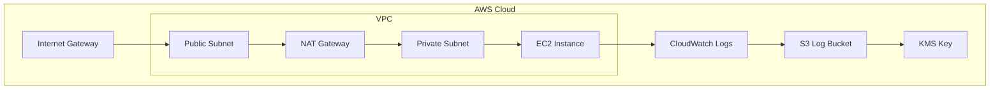

# Cloud Security Foundations with Terraform

This project demonstrates a secure cloud security foundation built with Terraform in AWS. It focuses on secure networking, centralized logging, encryption, and foundational security controls that align with real-world cloud security engineering practices.

## Objectives
- Build a secure AWS landing zone
- Implement encryption for logs and storage
- Enable logging and monitoring
- Apply infrastructure as code for repeatable deployment
- Practice cloud threat modeling and security design

## Services and Features
- Amazon VPC
- Public and private subnets
- NAT Gateway
- Internet Gateway
- Route tables
- S3 logging bucket
- AWS KMS encryption
- CloudWatch Log Group
- VPC Flow Logs
- IAM roles and policies
- 
## 🏗️ Architecture Overview
This project deploys a secure AWS environment that includes a VPC with public and private subnets, NAT Gateway for outbound access, centralized logging using CloudWatch and S3, and encryption using AWS KMS. The architecture is designed with security-first principles including network segmentation, least privilege, and logging visibility.

## 📊 Architecture Diagram

## Security Controls Implemented
- Encryption at rest using AWS KMS
- Centralized logging with CloudWatch and S3
- Public access restrictions on S3
- TLS enforcement for bucket access
- Network segmentation with public/private subnets
- IAM-based access design for logging services

## Project Structure
- `environments/aws/dev` – development environment deployment
- `modules/aws-vpc-secure` – reusable secure VPC module
- `modules/aws-kms-s3-encryption` – logging bucket and KMS module
- `docs/threat-model` – STRIDE threat modeling documents

## What I Learned
This project helped me strengthen my skills in Terraform, AWS networking, cloud logging, encryption, and secure infrastructure design. It also gave me hands-on experience troubleshooting Terraform plans, organizing reusable modules, and thinking through cloud security controls from both an engineering and defender perspective.

## Next Steps
- Add CloudTrail integration
- Add GuardDuty integration
- Expand detection engineering use cases
- Add architecture diagrams and screenshots
