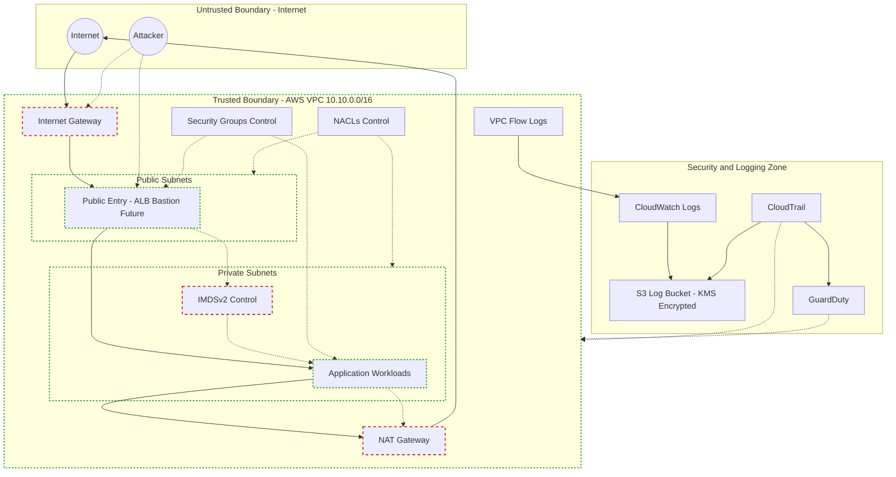

```mermaid
flowchart TB

  subgraph untrusted["Untrusted Boundary - Internet"]
    internet((Internet))
    attacker((Attacker))
  end

  subgraph vpc["Trusted Boundary - AWS VPC 10.10.0.0/16"]
    igw[Internet Gateway]

    subgraph public["Public Subnets"]
      entry[Public Entry - ALB Bastion Future]
    end

    subgraph private["Private Subnets"]
      app[Application Workloads]
      imds[IMDSv2 Control]
    end

    nat[NAT Gateway]
    flow[VPC Flow Logs]
    sg[Security Groups Control]
    nacl[NACLs Control]
  end

  subgraph sec["Security and Logging Zone"]
    cwl[CloudWatch Logs]
    s3[S3 Log Bucket - KMS Encrypted]
    ct[CloudTrail]
    gd[GuardDuty]
  end

  %% Normal traffic
  internet --> igw
  igw --> entry
  entry --> app
  app --> nat
  nat --> internet

  %% Logging
  flow --> cwl
  cwl --> s3

  %% Detection
  ct --> s3
  ct --> gd

  %% Attack paths (red dashed)
  attacker -.-> entry:::attack
  attacker -.-> igw:::attack
  entry -.-> imds:::attack
  imds -.-> app:::attack
  app -.-> nat:::attack

  %% Controls (green dashed)
  sg -.-> entry:::control
  sg -.-> app:::control
  nacl -.-> public:::control
  nacl -.-> private:::control
  ct -.-> vpc:::control
  gd -.-> vpc:::control

  %% Define styles
  classDef attack stroke:#d62728,stroke-width:2px,stroke-dasharray:5 5;
  classDef control stroke:#2ca02c,stroke-width:2px,stroke-dasharray:3 3;
```

